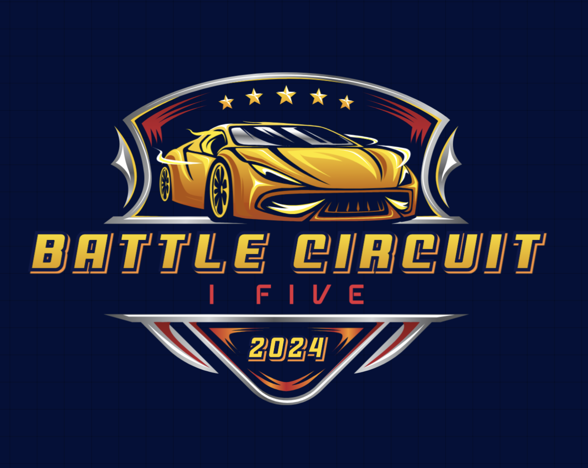
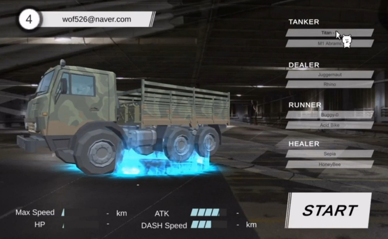
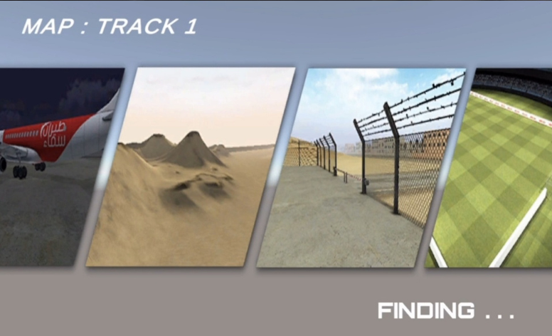
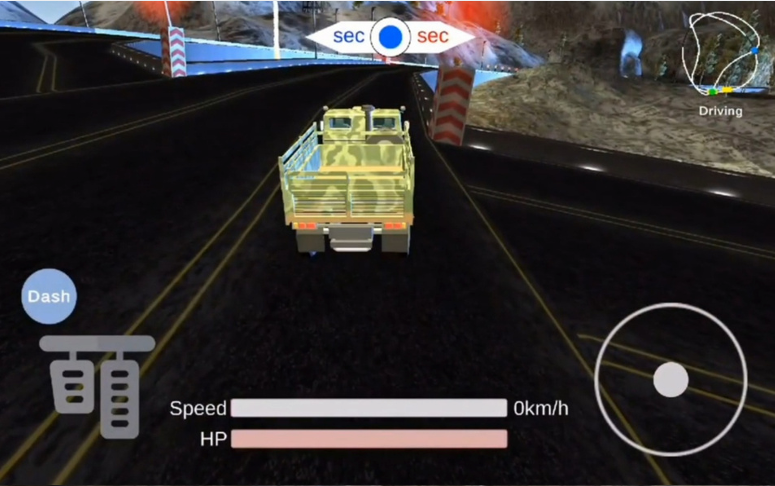
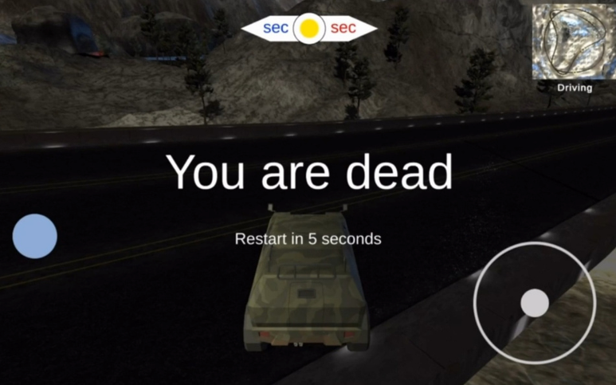

# 🚗 Battle Circuit (배틀 서킷)

---

## 📌 프로젝트 개요
- **플랫폼** : 안드로이드
- **장르** : 레이싱 · 액션  
- **기획 의도** : 단순한 레이싱을 넘어 팀플레이와 RPG 요소가 결합된 전투형 레이싱 게임 구현  
- **팀 구성** : 5인
- **개발 기간** : 2024.06 ~ 2024.08 (3개월)  

---

## 🎮 게임 진행 방식
- 4 vs 4 팀전  
- 각 팀은 트랙 양쪽 끝에서 출발  
- 약 20초 후, **점령지(트랙 중앙)** 활성화  
- 과반수가 10초 이상 점령 시 승리  

---

## ⚙️ 주요 시스템
- **로그인/회원가입** : Firebase + Google 로그인 연동  
- **로비** : 차량 선택 → 매치메이킹 → 게임 시작  
- **매치메이킹** : 각 팀이 탱커 / 딜러 / 러너 / 힐러 포지션 균형 맞춰 배정  
- **전투**  
  - 차량 충돌 (속력 차에 따라 HP 피해량 산정)  
  - 스킬 : 포지션별 고유 액티브 스킬 (쿨타임 존재, 대쉬 중 사용 불가)  
- **맵**  
  - 원형 서킷 기반
  - 미니맵 UI 제공  
- **경기 종료** : 점령 성공 시 승리

---

## 🏎️ 차량 포지션 & 특징

### 🔵 탱커
- HP 높음 / 속도 낮음  
- **역할** : 돌진 후 버티기, 아군 보호  
- **예시 차량**
  - Titan-3 : HP 800, 스킬 – 받는 피해 1/3, HP +200  
  - M1 Abrams : HP 1000, 스킬 – 8초 무적  

### 🔴 딜러
- 속도와 HP 중간  
- **역할** : 공격, 대쉬 활용  
- **예시 차량**
  - Rhino : HP 500, 스킬 – 대쉬 2배 피해 (6초)  
  - Juggernaut : HP 600, 스킬 – 제로백 1초 (10초간)  

### 🟢 러너
- 속도 빠름 / HP 낮음  
- **역할** : 빠른 진입, 점령 플레이  
- **예시 차량**
  - Buggy-0 : HP 300, 스킬 – 즉시 대쉬 진입  
  - Acid Bike : HP 150, 스킬 – 최대 속력 1.3배  

### 🟡 힐러
- 속도 보통 / HP 낮음  
- **역할** : 아군 회복 & 지원  
- **예시 차량**
  - Sepia : HP 250, 스킬 – 반경 10m 아군 회복 (+150)  
  - HoneyBee : HP 350, 스킬 – 대쉬 시 아군 충돌 회복 (+300)  

---

## 🛠️ 기술 스택
- **Unity 3D** (엔진)  
- **C#** (게임 로직)  
- **Firebase Authentication** (Google 로그인)  
- **Firebase Firestore** (플레이어 데이터 관리)  
- **Photon** (멀티플레이)  

---

## 📸 실제 플레이 화면

  
  

  
  

---

## 🚀 실행 방법
1. Unity에서 프로젝트 열기  
2. `Build Settings` → Android 선택  
3. APK 빌드 후 설치  
4. 구글 로그인 후 로비에서 차량 선택 → 매치메이킹 → 게임 시작  

---

## 👥 Contributors

### 정유라 (팀장, 서버 개발)
- 기획 및 서버 개발
- 구글 로그인
- 위치 및 회전 동기화
- Firebase와 Photon 연결
- 점령지 시스템 서버 구현

### 김지윤 (서버 개발)
- 매치메이킹
- 팀 기능 구현
- 전반적인 차 주행 시스템
- 차 스폰 시스템

### 서가은 (클라이언트 개발)
- 게임 내부 UI 제작
- 로비 및 매치메이킹 씬 제작
- 사운드 작업 및 미니맵 제작
- 점령지 구현
- 게임 종료 씬 구현

### 최선호 (서버 개발)
- 데이터베이스 연동
- 맵 재구성
- HP바 및 카운트다운 화면 구현
- 차 스폰 시스템
- 발표 자료 제작

### 송채강 (서버 개발)
- 충돌 동기화
- 대쉬 기능
- 데이터베이스 연동

---

## 🏆 수상
숙명여자대학교 중앙 프로그래밍 동아리 Solux 24-1 프로젝트 발표회 **대상** 수상
